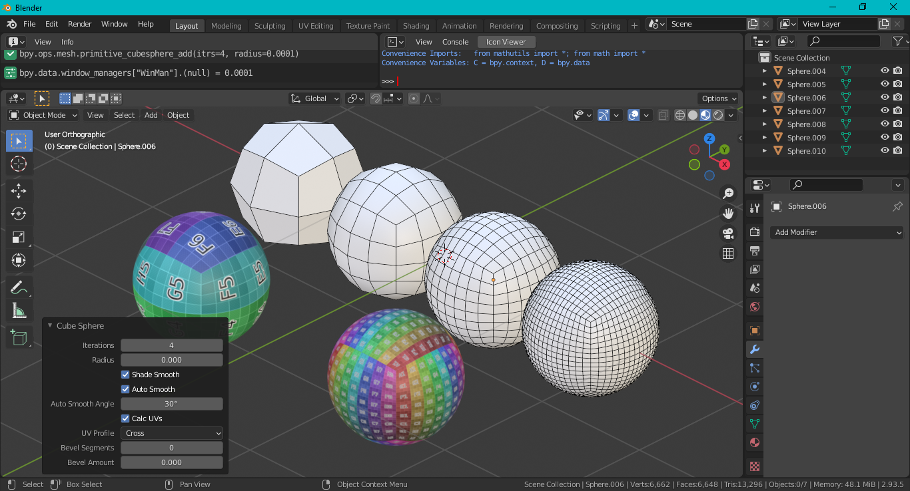

# Cube Sphere

Blender add-on to create a hard surface modeling friendly cube sphere.

To install, go to `Edit > Preferences > Add-ons`, then click the `Install` button and select the `cube-sphere.py` file. To add a sphere, go to `Add > Mesh > Cube Sphere` while in object mode.

The cube has 2 UV profiles: a cross pattern like the Blender cube; and a square per face.

Includes an option to append a bevel modifier to the cube object. By default, the outer miter is set to arc and the limit method is set to angle.